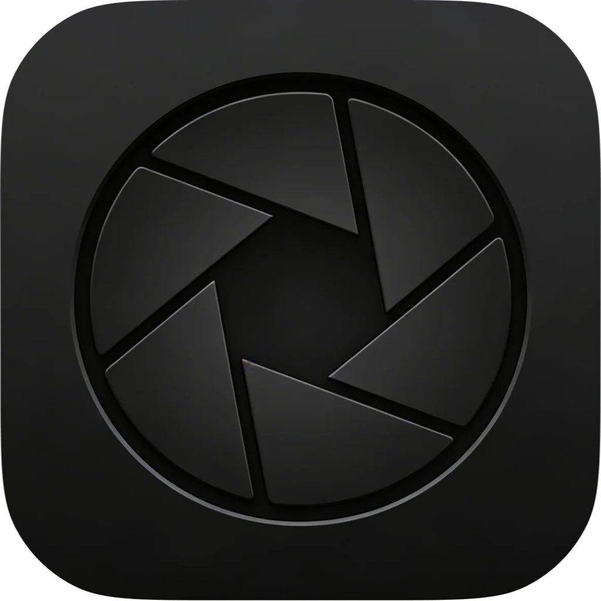
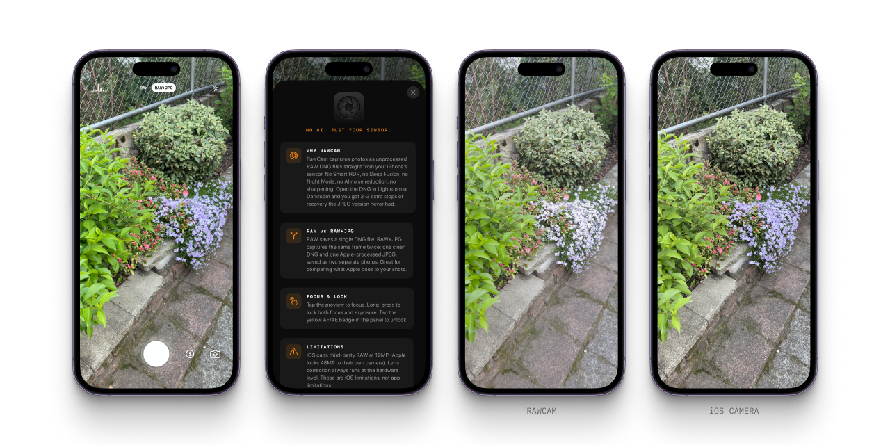

<p align="center">
  
</p>
<h1 align="center">RawCam</h1>
<p align="center">A minimal iOS camera. Saves only the sensor's raw DNG.</p>
<p align="center"><strong>v1.0</strong> · iOS 17+</p>

<p align="center">
  <a href="https://apps.apple.com/us/app/rawcam-raw-dng-camera/id6765531876">
    
  </a>
</p>

---

<p align="center">
  
</p>

---

RawCam is a minimal iOS camera that saves only the sensor's raw DNG. Tap the shutter, open the file in Lightroom or any RAW editor, and process it yourself.

## What it does

- **RAW mode.** Saves a single 12MP DNG with zero AI processing.
- **RAW+JPG mode.** Captures both a clean DNG and an Apple-processed JPEG simultaneously (saved as two photos). Useful for comparing what the stock pipeline does to a shot.
- **Tap to focus.** Tap anywhere on preview. Long-press to lock AF + AE.
- **Flash toggle.** Off / on / auto.
- **Front / back camera** switch.
- **Live histogram.** 8-bar readout, shadows to highlights.

## Why not just use the iOS Camera app?

The stock Camera app runs every shot through an AI pipeline: Smart HDR, Deep Fusion, tone mapping, noise reduction, sharpening. Once applied, the original sensor data is gone. In dynamic range or low light, that's 2–3 stops of recovery baked out of the JPEG you can never get back. RawCam saves the DNG before any of that happens.

## How to build & install

Requires Xcode 15+ and an iPhone connected via USB.

```bash
# Build
xcodebuild -project RawCam.xcodeproj -scheme RawCam \
  -destination 'id=<YOUR_DEVICE_ID>' \
  -allowProvisioningUpdates build

# Install
xcrun devicectl device install app \
  --device <YOUR_DEVICE_ID> \
  /path/to/DerivedData/RawCam.../RawCam.app
```

Find your device ID:

```bash
xcrun xctrace list devices
```

## Known limitations

- **12MP cap.** iOS caps third-party RAW capture at 12MP. The 48MP full sensor readout is locked to Apple's own camera pipeline, so any third-party app hits the same ceiling.

## Alternatives

RawCam is barebones. For manual controls, focus peaking, ProRAW, or a polished UI, use [Halide](https://halide.cam), [ProCamera](https://www.procamera-app.com), or [Not Boring Camera](https://notbor.ing/products/camera) instead. All three are good.

RawCam is the free, open-source version that does one thing.

## Stack

- Swift + SwiftUI + AVFoundation + Photos
- No dependencies, no packages

## Feedback

Found a bug or have a feature idea? See the [support page](docs/support.md) for FAQs and contact info, or [open an issue](https://github.com/madebysan/rawcam/issues).

## License

[MIT](LICENSE)

---

Made by [santiagoalonso.com](https://santiagoalonso.com)
